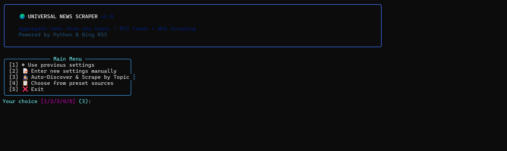

# 🌍 Universal News Scraper v4.1

[](https://www.python.org/)
[](LICENSE)
[](https://www.bing.com/news)

A powerful, terminal-based news aggregator that supports **RSS feeds**, **Web Scraping**, and **Topic Auto-Discovery** via Bing News RSS.



---

## ✨ Key Features

| Feature | Description |
|---------|-------------|
| 🕵️ **Auto-Discovery** | Find news on ANY topic (Crypto, Sports, Politics, AI) without knowing the URL |
| 📂 **Preset Categories** | 6 built-in categories with 30+ international news sources |
| 🛡️ **Anti-Blocking** | Random User-Agent rotation to bypass restrictions |
| 💾 **Multi-Format Export** | Save results as CSV, JSON, HTML, or ALL formats |
| 🎨 **HTML Reports** | Beautiful dark-themed HTML reports with article cards |
| 🔇 **Noise Filter** | Automatically filters out generic Bing category entries |
| 🔗 **Real URL Extraction** | Extracts actual article URLs from Bing redirects |
| 📅 **Date Filtering** | Only get articles from a specific date onwards |
| 🔑 **Keyword Filtering** | Filter articles by multiple keywords |
| 🔄 **Settings Memory** | Remembers your last configuration for quick re-runs |

---

## 🆕 What's New in v4.1

- 🌐 **HTML Export** - Beautiful dark-themed HTML reports
- 🔇 **Enhanced Noise Filter** - Filters generic Bing entries (Top stories, Entertainment, etc.)
- 🔗 **Real URL Extraction** - Extracts actual article URLs from Bing redirects
- 📰 **Real Source Detection** - Shows the actual news source instead of "Bing"
- 📤 **4 Export Options** - CSV, JSON, HTML, or All formats

---

## 📂 Preset Categories

| Category | Sources |
|----------|---------|
| 📰 **International News** | BBC, CNN, Reuters, Al Jazeera, The Guardian, NPR |
| ⚽ **Sports** | ESPN, BBC Sport, Sky Sports, Bleacher Report |
| 💻 **Tech & Science** | TechCrunch, The Verge, Wired, Ars Technica, Space.com |
| 🔒 **Cybersecurity** | The Hacker News, BleepingComputer, Krebs, Dark Reading |
| 💰 **Business & Finance** | Bloomberg, CNBC, Financial Times, CoinDesk, CoinTelegraph |
| 🎬 **Entertainment** | Variety, Hollywood Reporter, IGN, Kotaku |

---

## 🚀 Quick Start

### 1. Clone the Repository

```bash
git clone https://github.com/Ilias1988/Universal-News-Scraper.git
cd Universal-News-Scraper
```

### 2. Create Virtual Environment (Recommended)

```bash
python -m venv venv

# Windows
venv\Scripts\activate

# Linux/Mac
source venv/bin/activate
```

### 3. Install Dependencies

```bash
pip install -r requirements.txt
```

### 4. Run the Scraper

```bash
python scraper.py
```

---

## 📖 Usage Guide

### Main Menu

```
╭─────────────────────────────────────────╮
│  🌍 UNIVERSAL NEWS SCRAPER v4.1         │
│  Powered by Python & Bing RSS           │
╰─────────────────────────────────────────╯

┌──────────────── Main Menu ─────────────────┐
│ [1] 🔄 Use previous settings               │
│ [2] 📝 Enter new settings manually         │
│ [3] 🕵️ Auto-Discover & Scrape by Topic     │  ← Recommended!
│ [4] 📋 Choose from preset sources          │
│ [5] ❌ Exit                                │
└────────────────────────────────────────────┘
```

### Export Format Options

```
📤 Export Format:
  [1] CSV only
  [2] JSON only
  [3] HTML only      ← Beautiful dark-themed report!
  [4] All formats    ← CSV + JSON + HTML
```

---

## 📤 Output Formats

### CSV Output (`results.csv`)

```csv
title,url,date,description,source,matched_keywords
"AI Revolution in 2026...",https://techcrunch.com/...,2026-01-20,"Description...",Techcrunch,"AI, technology"
```

### JSON Output (`results.json`)

```json
[
  {
    "title": "AI Revolution in 2026...",
    "url": "https://techcrunch.com/...",
    "date": "2026-01-20",
    "description": "Description...",
    "source": "Techcrunch",
    "matched_keywords": "AI, technology"
  }
]
```

### HTML Output (`results.html`)

Beautiful dark-themed report with:
- 📊 Stats header showing article count
- 📰 Article cards with hover effects
- 🏷️ Keyword badges
- 🔗 Clickable links to original articles
- 📱 Responsive design

---

## 🛠️ Requirements

```
requests>=2.31.0
beautifulsoup4>=4.12.0
feedparser>=6.0.0
fake-useragent>=1.4.0
htmldate>=1.6.0
rich>=13.7.0
lxml>=4.9.0
```

---

## 📁 Project Structure

```
Universal-News-Scraper/
├── scraper.py           # Main application
├── sources.json         # Preset RSS sources (editable)
├── requirements.txt     # Python dependencies
├── .scraper_config.json # Auto-saved settings (ignored by git)
├── .gitignore           # Git ignore file
├── LICENSE              # MIT License
└── README.md            # This file
```

---

## 📌 Examples

### Example 1: Find Bitcoin News

```
Select option: 3
Enter topic: Bitcoin
Keywords: (empty for all)
Export format: 4 (All)
→ Saves bitcoin_news.csv, bitcoin_news.json, bitcoin_news.html
```

### Example 2: Scrape Cybersecurity Sources

```
Select option: 4
Select category: 4 (Cybersecurity)
Select sources: A (ALL)
Keywords: ransomware
Export format: 3 (HTML)
→ Generates beautiful HTML report
```

---

## ⚠️ Disclaimer

This tool is intended for **educational and research purposes only**. 

- Always respect websites' Terms of Service
- Don't overwhelm servers with excessive requests
- Use responsibly for legitimate research and news aggregation

---

## 📄 License

MIT License - Feel free to use and modify!

---

## 🔄 Changelog

### v4.1 (Current)
- 🌐 Added **HTML Export** with dark theme
- 🔇 Enhanced **Noise Filter** for Bing RSS
- 🔗 **Real URL Extraction** from Bing redirects
- 📰 **Real Source Detection** (shows actual source, not "Bing")
- 📤 4 export options (CSV, JSON, HTML, All)

### v4.0
- 🎨 Complete UI rebrand - "Universal News Scraper"
- 🌐 Switched from Google Search to **Bing News RSS**
- 📂 6 international preset categories with 30+ sources

### v3.0
- Added Topic Discovery via Google Search
- Cybersecurity-focused preset sources

---

**Happy Scraping! 🌍📰**
